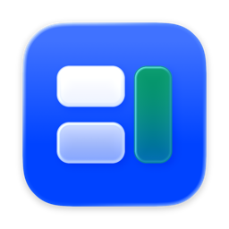

<p align="center">
  
</p>

<h1 align="center">BetterTile</h1>

**A native macOS window manager that resizes neighbours together, not just one window at a time.**

[](https://github.com/LMC-Karma/BetterTile/actions/workflows/ci.yml)
[](LICENSE)
[](#what-you-need)
[](https://swift.org)
[](#bettertile-is-free)

BetterTile is built with Swift, SwiftUI, AppKit, and the public macOS
Accessibility API. No private APIs, no code injection, no SIP workarounds, and
no behavioral tracking. Sparkle is the only runtime dependency and provides
secure update checks. BetterTile currently asks for one permission and explains
why before it does.

---

## Everything it does

### Drag windows where they belong

Drag a window toward an edge or corner and BetterTile previews the zone before
you let go. Snapping only engages on a real title-bar drag, so it never fights
you while you are working inside a window.

### Resize neighbours together

Hover the seam between two adjacent windows and drag it. Both windows resize
against the shared boundary at once. Choose a **ghost** preview that commits on
release, or **live** resizing that updates as you move. Boundaries are derived
from actual window frames within a tolerance you control, so a seam is only
offered when it genuinely exists.

### Bento tiling that adapts

Bento arranges the visible windows on each display into a split tree. New
windows are placed by scoring every candidate split and picking the one that
moves and resizes the least. Panes carry weights and locks, and you can swap,
retarget, or float any window out of the layout. Resize a Bento pane natively
and the tree adopts the change rather than fighting it.

### Keyboard shortcuts that don't collide

Global shortcuts for every standard action, with conflict detection so you find
out at assignment time instead of the first time a shortcut silently fails.

### Undo the placement, not just the window

BetterTile keeps a bounded frame history per window, so a misplaced action is
one step back rather than a manual reconstruction.

---

## What you need

- Apple Silicon Mac
- macOS 26 or later
- Accessibility permission (the only permission BetterTile requests)

To build it yourself, also Xcode 26 / Swift 6.3 or later.

---

## Install

Public beta builds are distributed as disk images from
[GitHub Releases](https://github.com/LMC-Karma/BetterTile/releases). Download
the latest `BetterTile-*-beta.dmg`, open it, and drag BetterTile into the
Applications shortcut before launching it.

The beta application is **ad-hoc signed**: it carries a valid macOS code
signature, but it is **not signed with a Developer ID**. macOS therefore cannot
identify the developer and will refuse the first launch. Open **System Settings
→ Privacy & Security**, find the message about BetterTile, and choose **Open
Anyway**, after confirming that the download came from this repository. You can
also check the download against the `.sha256` file published beside it.

Updates are authenticated separately: each DMG carries an EdDSA signature that
Sparkle verifies against a public key built into the app, independently of the
macOS code signature.

BetterTile checks the repository's GitHub-hosted update feed once per day by
default. It shows release notes and asks before downloading or installing. You
can turn automatic checks off in General Settings or use **Check for Updates…**
at any time.

> **Public beta limitation.** Ad-hoc signatures differ from build to build, so
> macOS treats an updated BetterTile as a new application and **the
> Accessibility permission does not survive an update**. After installing an
> update, open **System Settings → Privacy & Security → Accessibility**, remove
> BetterTile with the **–** button, and add it again. Signing with a Developer
> ID certificate is what removes this step.

To build it from source instead:

```sh
git clone https://github.com/LMC-Karma/BetterTile.git
cd BetterTile
cp Config/LocalSigning.xcconfig.example Config/LocalSigning.xcconfig
```

Add your Apple ID in **Xcode → Settings → Accounts**, then replace
`YOUR_TEAM_ID` in `Config/LocalSigning.xcconfig` with your Personal Team ID.
The local file is gitignored, so signing never changes the shared Xcode project.
Then run `open BetterTile.xcodeproj`, select the shared **BetterTile** scheme,
and run. BetterTile launches into the menu bar; the Dock icon is optional and
off by default. On first launch it explains how to grant Accessibility
permission. See [Development setup](docs/DEVELOPMENT.md) for Team ID discovery
and agent setup.

For command-line validation:

```sh
swift test
swift build
```

`Package.swift` intentionally exposes only the supporting libraries, so Xcode
cannot offer a bundle-less duplicate BetterTile executable.

### Keeping Accessibility permission across rebuilds

macOS ties privacy grants to an app's code-signing designated requirement.
Xcode's **Sign to Run Locally** ad-hoc identity changes on every rebuild, so
macOS cannot carry the Accessibility grant forward and you end up re-granting it
constantly.

Fix it once: add an Apple ID under **Xcode › Settings › Accounts**, then put
that account's Personal Team ID in the gitignored
`Config/LocalSigning.xcconfig`. Keep the bundle identifier unchanged and always
launch the Xcode app target rather than the Swift package executable. After
switching from ad-hoc to Apple Development signing, remove the stale BetterTile
entry from Accessibility once and grant the newly signed build access. Later
rebuilds signed by the same team keep the grant.

---

## Private by default

BetterTile reads window geometry through the public Accessibility API and does
nothing else with it. It does not send window data, configuration, analytics,
telemetry, or crash reports anywhere. Your configuration is a plain JSON file
on your own disk.

Update checks contact GitHub to fetch the public Sparkle appcast and release
archive. They do not include BetterTile window data, configuration, diagnostics,
analytics, telemetry, crash reports, or a Sparkle system profile. See the
[security and privacy policy](SECURITY.md) for the review requirements that
apply to any future network, data, dependency, or permission change.

Accessibility is currently the sole mandatory permission, and BetterTile
explains what it is for in-product before requesting it.

---

## Known limits

- **No cross-Space window movement.** macOS exposes no public API that can do
  this safely, and BetterTile will not use a private one to fake it.
- **Stage Manager thumbnails are ignored.** Scaled thumbnails are rejected
  rather than treated as real windows.

---

## BetterTile is free

BetterTile is free, and it will always be free. There is no paid tier, no
subscription, no trial, and no feature held back behind a purchase. It is
released under the [GNU GPL v3 or later](LICENSE) — use it, read it, fork it,
and share modified versions under the same license.

---

## Documentation

- [Architecture](docs/ARCHITECTURE.md) — layer boundaries, coordinate model,
  event ordering, and the Bento split tree
- [Development setup](docs/DEVELOPMENT.md) — build, sign, run, and test on your
  own Mac
- [Beta releases](docs/RELEASING.md) — version, validate, sign, and publish an
  update
- [Contributing](CONTRIBUTING.md) — branch, test, and pull-request workflow
- [Security](SECURITY.md) — reporting policy and permission rules
- [Third-party notices](THIRD_PARTY_NOTICES.md) — upstream code and attribution
- [AGENTS.md](AGENTS.md) — build, test, and convention rules for AI coding
  agents

---

## Acknowledgements

BetterTile exists because other people published their work openly.

- **[Vorssaint](https://github.com/vorssaint/vorssaint-utils)** — BetterTile
  includes adapted settings and menu-panel presentation code from Vorssaint,
  and its demand-based service ownership shaped BetterTile's runtime lifecycle.
  See [Third-party notices](THIRD_PARTY_NOTICES.md) for attribution and terms.
- **[Rectangle](https://github.com/rxhanson/Rectangle)** — the reference for
  event-driven window management on macOS, and a reminder that the best window
  manager is the one doing nothing until you ask.

Thank you to both. Open source made this better.

---

Made by [@LMC-Karma](https://github.com/LMC-Karma)
